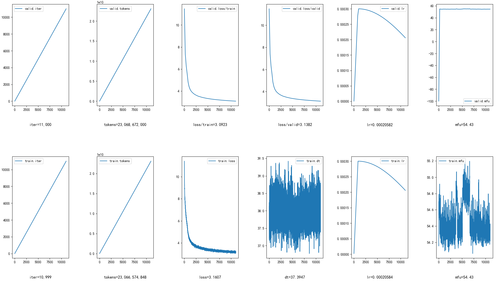

# llm-zero2all

从零开始编写与大语言模型有关的所有代码，用于学习，后续会完善相应的文档。

1. [构建数据集](#01-数据集)，使用多个公开数据集，构建文本文件来训练分词器，通过分词器构建bin文件用于训练，能从多个文件中挑选出部分内容作为验证集。

    * 可以**预先构建tokenized**的bin文件，然后**使用索引**读取数据集，节省内存，
        * pretrain使用`pretokenize_data_more.py`和`build_pretrain_sample_index_map.py`构建数据集的bin文件和索引。
        * sft使用`pretokenize_sft_data.py`构建数据集的bin文件和索引。

2. [分词器](#02-分词器tokenizer)，两个，huggingface的`tokenizers`，`sentencepiece`，最后构建出的类可以通过`save_pretrained(dir)`保存，通过`AutoTokenizer.from_pretrained(dir)`导入。

3. [模型结构](#03-模型结构-z2all-使用-llama2-结构)，使用llama2结构，并且将多个模块更改为**融合算子**（包括flash-attn, rope, cross_entropy, rmsnorm, swiglu, AdamW），加速计算。

4. [训练](#04-训练)，使用自己实现的DDP和分布式优化器（基于Megatron-LM源码，简化）来训练，代码实现更易懂

    * PyTorch的DDP的预训练脚本：`pretrain_legacy.py`，版本较老（不包含各种计算通信重叠、SFT等新功能），只能进行预训练。
    * 自己实现的**DDP和分布式优化器**，参考Megatron-LM源码，简化实现代码，添加部分新功能，脚本见：**`train_my_ddp.py`**。
        * 实现**混合精度优化器**
        * 可以使用register_comm_hook来**自定义梯度通信**
        * 实现**三种通信和计算重叠**（overlap_grad_reduce, overlap_param_gather, overlap_optim_step）
        * `train_my_ddp.py`包括**预训练和微调**。
    * **PowerSGD**的实现，压缩需要通信的梯度大大加快了训练速度，基于PyTorch源码，通过cuda的stream和event实现了powerSGD_hook的异步，能与grad_reduce并行。同时添加了多个优化（`parallel/distributed_data_parallel/ddp_comm_hooks/powerSGD_hook.py`）
    * 简单的**实验过程可视化**代码（通过ssh远程获取文件来可视化）。
    * 训练可以从**断点重新训练**，且重新训练时结果与之前一致（可复现），保存的方式更加稳定（保存最优和次优的文件，防止保存失败导致文件损坏）
    * 实现训练进程的监控，当进程异常中断时，监控进程可以**自动重新启动进程**（`monitor_process.py`）

5. [微调](#05-sft有监督微调指令微调)，实现**SFT（有监督微调，指令微调）**，通过自己构建的指令数据集来微调。
    * **训练脚本**见：`train_my_ddp.py`，更改部分实验参数即可。
    * 提供**指令数据集的构建**代码，见`./sft`目录。
    * 实现SFT数据集的**加载和预处理**（包括单轮指令数据集和多轮对话数据集conversation），见：`dataset/dataset_sft.py`。
    * 提供多轮对话数据集的预处理，包括构建**pretokenize**的bin文件和用于**索引**样本的sample_index_map索引文件，包括多轮对话模板的构建（见：`dataset_preprocess/pretokenize_sft_data.py`），见：`utils/conversation.py`

6. [DPO](#06-dpodirect-preference-optimization)，实现**DPO（Direct Preference Optimization）**，参考trl库，自己构建的DPODataset。
    * **训练脚本**见：`train_my_ddp.py`，更改部分实验参数即可。
    * 实现DPO数据集的**加载和预处理**（目前只支持conversation格式的数据集），见：`dataset/dataset_dpo.py`。

7. [Docker镜像](#10-docker镜像)，提供已经构建好的docker镜像，包含实验所需的所有环境。

项目所有文件的描述如下：

```txt
- cuda/, 使用PyTorch的profiler测试cuda的stream和event的代码

- data/, 存放训练数据，一些简单的数据预处理，如划分训练集和验证集，提取wikipedia的数据，获取原始文件的所有text用于tokenizer的训练
    get_train_data_json.md, 通过GPT提示，编写提取文件的脚本
    get_train_data_json.sh, 数据集过大时可能不想取所有文件，如只想取10G用于tokenizer的训练，这个脚本可以指定不同数据集的文件个数，然后提取文件，进行了随机打乱
    get_txt_for_train_tokenizer.py, 从get_train_data_json提取后的文件夹中的json文件提取出text内容，用于tokenizer的训练
    get_valid_data.py, 对pretokenize后的bin文件预先进行数据集的划分，（这里建议不进行划分，后续dataset中会根据索引自动划分，更加方便）
    data/max_sentence_length.py, 获取文件夹下的文本文件所有行的最大长度
    wikipedia_cn_extract_json.py, 提取wikipedia原始数据为json文件
    wikipedia_cn_extract_parquet.py, 提取wikipedia原始数据为parquet文件

- data_preprocess/, 数据集的一些预处理，如pretokenize，和预先构建索引（用于pretrain和sft）
    build_pretrain_sample_index_map.py, 基于bin文件，构建对应pretrain的数据索引，这样可以不用将整个数据集读入内存
    pretokenize_pretrain_data.py, pretokenize，将[".parquet", ".json", ".jsonl"]类型文件tokenize为[".bin"]文件，用于后续的pretrain
    pretokenize_sft_data.py, 对原始conversation格式的sft数据集，进行pretokenize和构建索引

- dataset/, 三种数据集类的构建（ pretrain, sft, dpo ）
    dataset_dpo.py, DPODataset类，支持conversation格式的数据集，内部会进行preprocess
    dataset_legacy.py, 老版本的pretrain数据集构建，用于pretrain_legacy.py脚本
    dataset_pretrainpy, PretokDataset类，还有一个PretokDatasetWithIndex类（推荐使用，需要通过build_pretrain_sample_index_map.py构建索引）
    dataset_sft.py, SupervisedDataset类，支持conversation和instruction格式的数据集，内部会进行preprocess（也可以使用pretokenize_sft_data.py预先构建索引）

- distributed/, 分布式工具模块
    distributed_c10d.py, 实现get_global_rank，因为PyTorch1.12下没有这个函数

- docker/, docker容器
    build_docker_image.md, 详细描述了docker的构建过程

- example/, 例子
    - test_example/, 之前进行的一些测试代码
        - test_sft_dpo/, 测试sft和dpo
        ...

- model/, 模型结构的实现，包括一些融合算子的代码（复制过来的）
    configuration_z2all.py, 模型配置类
    fused_cross_entropy.py, fused_rotary_embedding.py, 融合算子函数，方便调用，从flash-attn仓库复制过来
    modeling_z2all.py, 模型结构代码，包括各种融合算子，实现kv-cache
    README.md, 说明文档

- optimizer/, 优化器的包裹类，有Float16OptimizerWithFloat16Params等，实现混合精度
    optimizer_config.py, 优化器配置文件（注意只是简单的配置参数，不包括具体优化器的超参数）
    optimizer.py, 混合精度优化器的基类：MixedPrecisionOptimizer，Float16OptimizerWithFloat16Params类（包括fp16, bf16），FP32Optimizer类（fp32）

- parallel/, 分布式训练的实现
    - distributed_data_parallel/, 实现DDP，提供ddp_comm_hooks，可以自定义梯度通信函数，实现PowerSGD算法
        - ddp_comm_hooks/, 包含所有实现的comm_hook
            default_hooks.py, 常用hook，包括all_reduce, reduce_scatter, stream_wrapper等
            overlap_optim_step_hooks.py, 梯度通信后，立刻进行异步的优化器优化，可以和下一个梯度通信重叠
            powerSGD_hook.py, PowerSGD算法的实现，hook形式，修改梯度通信的过程
        distributed_data_parallel_config.py, DDP配置类
        distributed_data_parallel.py, DDP的实现，自己管理模型参数和梯度的内存，划分为bucket用于梯度通信，考虑多个计算通信重叠
        param_and_grad_buffer.py, 模型参数和梯度的buffer，即自己管理其内存，一个buffer中有多个bucket
    - distributed_optimizer/, 实现DistributedOptimizer，分布式优化器，目前还没有对保存函数进行测试
        distributed_optimizer.py， ZeRO1，DistributedOptimizer类，继承混合精度基类，构建模型参数与buffer位置的对应关系
    README.md, 说明文件

- tokenizer/, 包括tokenizer类的代码（huggingface和sentencepiece），训练tokenizer的代码
    - hf_bbpe_tokenizer/, 自己构建好的tokenizer，使用tokenizers库训练10G文本（中英对半）得到，可使用AutoTokenizer保存和加载，自己来管理special_tokens
    - sp_bbpe_tokenizer/, 自己构建好的tokenizer，使用sentencepiece库训练20G文本（中英对半）得到，可使用AutoTokenizer保存和加载，自己来管理special_tokens
    train_config.py, 训练tokenizer时的配置文件
    train_tokenizer.py, 训练tokenizer的脚本

- utils/, 工具模块
    - sft/, 使用self-instruct构建指令数据集的代码
        generate_instruction.py, self-instruct生成指令数据集
        local_utils.py, 工具模块
        prompt_cn.txt, 翻译后的提示
        prompy.txt, Alpaca原始的提示文件
        README.md， 说明文件
        seed_tasks_cn.jsonl, gpt-4o翻译后的种子指令
        seed_tasks.jsonl, Alpaca原始的种子文件
    checkpoint.py, 状态保存
    conversation.py, 多轮对话模板构建，可以进行prompt的tokenize，并且生成对应的掩码后的labels
    dpo.py, dpo的实现，基于model、ref_model、batch（包括chosen, rejected）计算得到dpo_loss
    my_logging.py, 实现不同的logger.handler，包括输出到文件中，过滤不想输出的内容，设置合适的输出格式
    reslog.py 和 resplot.py, 一起使用，reslog.py在训练脚本中保存实验结果，resplot.py将保存的实验结果可视化
    tensor.py, tensor相关的一些函数，如pad_to_length()，将tensor的某个维度进行扩展
    train.py, 训练相关的一些函数，如优化器的配置、mfu的计算、forward_step函数（pretrain, sft, dpo）
    utils.py, 一些通用的工具函数

configurator.py, 解析训练脚本的命令行

hfd.sh, 下载huggingface中的模型和数据集（见：https://hf-mirror.com/）

monitor_process.py，监控训练进程，当进程异常中断时，能够自动重新启动进程

monitor_train_my_ddp.sh，运行monitor_process.py的脚本例子

pretrain_legacy.py, PyTorch的DDP的预训练脚本，版本较老（不包含各种计算通信重叠、SFT等新功能）

README.md, 说明文档

requirements.txt，环境

train_my_ddp_legacy.py, 自己实现的DDP的训练脚本，支持（pretrain, sft），版本较老

train_my_ddp.py, 自己实现的DDP的训练脚本，支持（pretrain, sft, dpo），版本最新

train_task.py, 用于训练时的任务构建，可以无限生成训练需要的iter_batches
```

#### 其他说明

单卡训练脚本也可以看train_my_ddp.py（就没用到分布式训练，不过分布式训练的实现代码算是这个项目的重要内容）。

不用分布式训练的话（其实流程差不多，只是预训练脚本稍有不同），流程应该只有数据集的构建（还没实现数据清洗）、分词器的构建、llm经典结构的构建（llama2，使用融合算子）、预训练阶段。

这个项目目前还算不上是学习教程（说明文档还没咋写，或者写的比较乱，等后面有空了完善下），主要是代码实现基本从零开始（调的库少，尽量从零开始编写），可以先看着代码学习（注释写的还算详细）。

---

#### 目前预训练情况

1.7B_2024-06-27.png如下，当前1.7B模型预训练的日志文件见：1.7B_pretrain_now.txt



## 00 环境配置
我的环境：cuda11.4, pytorch1.12.1

见 requirements.txt（pip freeze > requirements.txt暴力生成），融合算子相应库的具体安装可以看[03-融合算子小节](#融合算子)。

### Docker
我自己构建了docker镜像（dockerhub和阿里的容器镜像），包含了所需要的环境（安装了融合算子相应的库），见章节：[Docker镜像](#10-docker镜像)

### 硬件
查看卡间通信：`nvidia-smi topo -m`

GPU通信方式：https://zhuanlan.zhihu.com/p/74217534

## 01 数据集
### 包含的数据集

1. baike2018qa，https://github.com/brightmart/nlp_chinese_corpus
2. new2016zh，https://github.com/brightmart/nlp_chinese_corpus
3. webtext2019zh，https://github.com/brightmart/nlp_chinese_corpus
4. wikipedia_cn_20240418，根据最新自己处理的，处理流程我参考的：https://www.cnblogs.com/carolsun/p/13860730.html 和 https://spaces.ac.cn/archives/4176
5. Zhihu-KOL，https://huggingface.co/datasets/wangrui6/Zhihu-KOL
6. WuDaoCorpus2.0_base_200G，大，https://data.baai.ac.cn/details/WuDaoCorporaText
7. wikipedia_en_20220301，https://hf-mirror.com/datasets/legacy-datasets/wikipedia/tree/main/data/20220301.en
8. github-python，https://huggingface.co/datasets/thomwolf/github-python
9. TigerBot，中英都有，较大，https://github.com/TigerResearch/TigerBot

我预训练用的TigerBot(pretrain_en, pretrain_cn) + github-python + news2016zh, bin文件有51G（差不多26B的token，一个token两个字节）

| 类别  | 文件名                     | raw大小 | 存储格式                 | json大小 | txt大小 | train |
| ----- | ------------------------- | ------- | ----------------------- | -------- | ------- | ----- |
| 中文  | baike2018qa               | 1.5G    | .json, 一行一json对象    | 1.5G, 8  | 1.3G    | 8/8   |
|       | new2016zh                 | 8.6G    | .json, 一行一json对象    | 8.5G, 44 | 7.5G    | 20/44 |
|       | webtext2019zh             | 3.8G    | .json, 一行一json对象    | 4.0G, 21 | 3.1G    | 21/21 |
|       | wikipedia_cn_20240418     | 2.5G    | .json, 一行一json对象    | 2.6G, 14 | 2.5G    | 14/14 |
|       | Zhihu-KOL                 | 1.4G    | .parquet                |          |         |       |
|       | WuDaoCorpus2.0_base_200G  | 201G    | .json, 一文件一json对象  |          |         |       |
| 英文  | wikipedia_en_20220301     | 11G     | .parquet                 | 20G, 103 | 19G     | 40/101|
| 代码  | github-python             | 2.1G    | .json, 一行一json对象    | 2.2G, 11 | 2.0G    | 11/11 |

**json文件**，一行一个json对象

`
{ gid: int, id: int, data_src: str, category: str, title: str, content: str, desc: str, others: dict }
`

### 命令
1. `hfd.sh`，下载huggingface模型和数据集, (--model, dataset)

    `./hfd.sh wikitext --dataset --tool aria2c -x 4 --include data/20220301.en`

2. `unzip`, 解压.zip

    `unzip file.zip -d ./data`

3. `unrar`, 解压.rar, x表示解压, 自动创建文件夹

    `unrar x file.rar`

4. `tar`, 解压.tar.gz，x表示解压缩文件，z表示通过gzip进行解压缩，f表示后面跟文件名

    `tar -xzf file.tar.gz`

5. `gunzip`, 解压.json.gz为.json

    `gunzip file.json.gz`

6. `du`, 显示文件大小，s不递归显示，h展示友好，以block-size为单位

    `du -sh * --block-size=1M`

### 注意
1. `data_str += json.dumps(data, ensure_ascii=False) + "\n"  # 注意加上ensure_ascii=False，否则会保存为Unicode编码`

2. chr(2581)表示unicode码位为2581整数，'\u2581'表示4位16进制的unicode编码，注意进制不同

3. 训练tokenizer时，训练集大小：20G，分成单位为200MB的txt文件
    1. hf， 占用内存：288G
    2. spm，占用内存：60G，错
    训练集大小：3G， hf ，txt，内存峰值：97G
    训练集大小：10G，hf ，txt，内存峰值：160G，训练时间22小时
    训练集大小：5G， spm，txt，爆
    训练集大小：4G， spm，txt，可
    训练集大小：20G，spm，txt，内存峰值：135G，训练时间22小时

4. 可以通过 `sys.path.append("../")` 来添加包的搜索路径

5. 通过`f.seek(0,2)`移动读写位置（offset: 0表示偏移，whence: 2表示文件末尾）和`f.tell()`获取当前读写位置，可以快速获得当前文件的bytes大小

### 流式读取文件

#### json
```python
def stream_json(file_path):
    with open(file_path, 'r') as f:
        objects = ijson.items(f, 'item')
        for obj in objects:
            yield obj
```

#### jsonl
```python
def stream_jsonl(file_path):
    with open(file_path, 'r') as f:
        for line in f:
            obj = json.loads(line)
            yield obj
```

#### parquet
见：https://stackoverflow.com/questions/68819790/read-write-parquet-files-without-reading-into-memory-using-python
```python
if file_path.endswith(".parquet"):
    # df = pd.read_parquet(file_path)  # 1.8GB
    # 流式读取，节省内存
    batch = ParquetFile(file_path)  # 0.5MB
    record = batch.iter_batches(
        batch_size=10,
        columns=["content"],
    )
    # df = pd.read_parquet(file_path)
    for lines in record:
        lines = lines.to_pydict()
        for text in lines["content"]:
            text = text.strip()  # 去除首尾空格
            yield text
```

## 02 分词器（Tokenizer）

### 1 训练自己的tokenizer

使用huggingface的tokenizers库或者sentencepiece库来构建分词器

#### 1.1 tokenizers库

具体使用方法见[tokenizers官方文档](https://huggingface.co/docs/tokenizers)

代码见train_tokenizer.py，注意事项：

* tokenizers库中的BPE没有实现byte_fallback，需要使用ByteLevel才行

* 通常，char-BPE可以使用NFKC，Byte-BPE一般不用

* tokenizers库中BPE下使用ByteLevel不会先构建256的词表，ByteLevelBPETokenizer会，所以要用BBPE的话，用ByteLevelBPETokenizer，其中可以改为自己的正则表达式来预分割

* tokenizers库中使用encode会区分特殊token（即不会对特殊token进行分割），这会导致用户能在文本中写入侵入文本（即能控制特殊token，会有一定的风险），但是我不知道怎么关闭这个功能，所以我把训练后的json中的added_token全部删除了，然后在构建自己的tokenizer类时自己来管理特殊token（缺点是效率可能会低点）

#### 1.2 sentencepiece库

具体使用方法见：[spm官方的python使用方法](https://github.com/google/sentencepiece/blob/master/python/README.md)

详细参数见：[scpm官方，训练所需参数](https://github.com/google/sentencepiece/blob/master/doc/options.md)

其他资料：[LLM大模型之基于SentencePiece扩充LLaMa中文词表实践](https://zhuanlan.zhihu.com/p/655281268)

### 2 使自己的tokenizer可以通过save_pretrained(dir)保存，通过AutoTokenizer.from_pretrained(dir)导入

参考chatglm-6b和Qwen-7B的构建代码和官方 (AutoTokenizer, PreTrainedTokenizerBase, PreTrainedTokenizer, PreTrainedTokenizerFast) 的源码

chatglm使用sentencepiece，https://huggingface.co/THUDM/chatglm-6b/blob/main/tokenization_chatglm.py

Qwen使用tiktoken，其自己管理特殊token，https://huggingface.co/Qwen/Qwen-7B/blob/main/tokenization_qwen.py

其他资料：[huggingface AutoTokenizer.from_pretrained流程](https://zhuanlan.zhihu.com/p/621106604)

下面介绍我总结的方法：

1. 构建一个类，继承PreTrainedTokenizer，然后通过上述训练得到的tokenizer，实现自己的encode和decode
2. 初始化，需要实现父类PreTrainedTokenizerBase的一个方法，在 `super.__init__(**kwargs)` 时会调用该方法
    ```python
    def get_vocab(self) -> Dict[str, int]:
        """
        返回词汇表
        """
        return self.tokenizer.get_vocab()
    ```
3. 要使用save_pretrained(dir)，需要实现父类两个方法
    ```python
    @property
    def vocab_size(self) -> int:
        """
        `int`: Size of the base vocabulary (without the added tokens).
        """
        return self.tokenizer.vocab_size
    
    def save_vocabulary(self, save_directory: str, filename_prefix: str | None = None) -> Tuple[str]:
        """
        保存tokenizer所需要的文件
        """
        tokenizer_file = os.path.join(
            save_directory, (filename_prefix + "-" if filename_prefix else "") + TOKENIZER_FILE
        )
        self.tokenizer.backend_tokenizer.save(tokenizer_file)
        
        return (tokenizer_file,)
    ```
    save_pretrained(dir)后会在dir构建三个文件：special_tokens_map.json, tokenizer_config.json, tokenizer.json
    
    注意，为了在from_pretrained(dir)时能正确加载，需要手动添加auto_map的信息，如下
4. 要使用AutoTokenizer.from_pretrained(dir)，需要1或2
    1. 要么在初始化时，添加如下代码，添加映射保证AutoTokenizer.from_pretrained(dir)可以加载（推荐）
        ```python
        self._auto_map = { "AutoTokenizer": ["my_hf_tokenizer.MyHFTokenizer", None] }
        ```
        其会在save_pretrained(dir)时，在tokenizer_config.json中自动添加auto_map
    2. 要么手动添加一个tokenizer_config.json文件（名字固定），内容为：
        ```json
        {
            "tokenizer_class": "MyHFTokenizer",
            "auto_map": {
                "AutoTokenizer": [
                "my_hf_tokenizer.MyHFTokenizer",
                null
                ]
            }
        }
        ```
    3. 注意，AutoTokenizer.from_pretrained(dir)实际调用的是PreTrainedTokenizerBase.from_pretrained(dir)

        通过搜索dir中的vocab_files文件，通过init_kwargs来传递到自己tokenizer类的__init__()中

        `vocab_files = {**cls.vocab_files_names, **additional_files_names}`

        所以属性名要对应好，例如，属性名是vocab_file，则要构建相应的字典作为类属性
        ```python
        class QWenTokenizer(PreTrainedTokenizer):
            """QWen tokenizer."""

            vocab_files_names = {"vocab_file": "qwen.tiktoken"}  # 此处key和下面的属性名对应

            def __init__(
                self,
                vocab_file,  # 对应上面，实际vocab_file = "dir/qwen.tiktoken"，即作用是获得完整路径
                errors="replace",
                extra_vocab_file=None,
                **kwargs,
            ):
        ```
        注意additional_files_names自动包含了一些要搜索的文件
        ```python
        additional_files_names = {
            "added_tokens_file": ADDED_TOKENS_FILE,  # kept only for legacy
            "special_tokens_map_file": SPECIAL_TOKENS_MAP_FILE,  # kept only for legacy
            "tokenizer_config_file": TOKENIZER_CONFIG_FILE,
            # tokenizer_file used to initialize a slow from a fast. Properly copy the `addedTokens` instead of adding in random orders
            "tokenizer_file": FULL_TOKENIZER_FILE,
        }
        ```

## 03 模型结构 Z2all (使用 llama2 结构)

包括flash-attn, rope, cross_entropy, rmsnorm, swiglu, AdamW的安装和使用

见：[模型结构 Z2all (使用 llama2 结构)](./model/README.md)

## 04 训练

有两个训练脚本：

1. `pretrain_legacy.py`，使用PyTorch版本的DDP

2. `train_my_ddp.py`，使用自己的DDP，支持分布式优化器，支持自定义comm_hook，目前这个版本最新

### train_my_ddp.py 训练脚本

1. 支持pretrain, sft, dpo任务
2. 支持单卡，单节点多卡，多节点多卡
3. 支持resume，需要添加 --resume --out_dir=out/2024_06_06_22_23_57

会自动搜索对应目录中的相应文件

多卡下会有警告，可以添加 OMP_NUM_THREADS=8 环境变量解决

运行快点用于测试，添加参数（注意gradient_accumulation_steps要能被ddp_world_size整除）：--train_batch_size=2 --gradient_accumulation_steps=3

#### pretrain

```bash
# 1. pretokenize, [".parquet", ".json", ".jsonl"] -> [".bin"]
python -m data_preprocess.pretokenize_pretrain_data --data_dir=data/02_train_data_more --tokenizer_dir=tokenizer/hf_bbpe_tokenizer

# 2. 预处理，构建索引, [".bin"] -> [".ibin"]
python -m data_preprocess.build_pretrain_sample_index_map --data_dir=data/02_train_data_more --max_seq_len=2048

# 3. train
# 单卡
python train_my_ddp.py --task_type=pretrain --data_dir=data/02_train_data_more

# 单节点多卡
torchrun --standalone --nproc_per_node=4 train_my_ddp.py --task_type=pretrain --data_dir=data/02_train_data_more

# 多节点多卡
# - master
torchrun --nproc_per_node=4 --nnodes=2 --node_rank=0 --master_addr=localhost --master_port=9527 train_my_ddp.py --task_type=pretrain --data_dir=data/02_train_data_more
# - remote
torchrun --nproc_per_node=4 --nnodes=2 --node_rank=1 --master_addr=10.10.24.107 --master_port=30846 train_my_ddp.py --task_type=pretrain --data_dir=data/02_train_data_more
```

#### sft

```bash
1. pretokenize，且构建索引（可不进行这一步，在线构建也可以，然后会自动保存为cache）
python -m data_preprocess.pretokenize_sft_data --data_dir=data/04_sft_conversation_data --tokenizer_dir=tokenizer/hf_bbpe_tokenizer

2. train
# 单卡

# - 使用pretokenize后的bin文件，只支持 sft_type=["conversation"]
python train_my_ddp.py --task_type=sft --data_dir=data/04_sft_conversation_data/01_bin_for_sft --sft_type=conversation

# - 使用原始的json，支持 sft_type=["conversation", "instruction"]
python train_my_ddp.py --task_type=sft --data_dir=data/03_sft_data --sft_type=instruction --use_dataset_with_index=False
python train_my_ddp.py --task_type=sft --data_dir=data/04_sft_conversation_data/train_3.5M_CN --sft_type=conversation --use_dataset_with_index=False
```

#### dpo

```bash
# 1. train，不支持pretokenize，会进行在线构建，然后会自动保存为cache，只支持conversation格式
python train_my_ddp.py --task_type=dpo --data_dir=data/05_dpo_data/DPO-En-Zh-20k
```

### 参数设置

参数设置可以参考，https://docs.nvidia.com/deeplearning/performance/dl-performance-fully-connected/index.html

词汇量最好设置为16字节的倍数，若使用bfloat16，则设置为8的倍数，若为A100，则使用64的倍数，见：https://huggingface.co/docs/transformers/perf_train_gpu_one

CUDA cuBLAS版本参考：https://docs.nvidia.com/cuda/archive/11.4.3/cuda-toolkit-release-notes/index.html

---
**注意**，参数大小的影响很大！

vocab_size=64320, 性能：3.28s, 55.21%, 27.89GB

vocab_size=64321, 性能：3.72s, 48.74%, 27.90GB

### 常用命令
1. `watch -n 0.5 nvidia-smi`，用来实时查看GPU使用情况，watch -n 0.5表示每0.5秒运行下后面的命令（刷新并运行）

### 实验结果保存与可视化
wandb用起来有点问题，5个iter后就报错：BrokenPipeError: [Errno 32] Broken pipe     sent = self._sock.send(data) BrokenPipeError: [Errno 32] Broken pipe

于是我自己使用pyqt5, matplotlib, ssh实现了一个实验结果保存与可视化的两个代码文件，见：`utils/reslog.py`和`utils/resplot.py`

主要功能是：远程服务器通过reslog来保存实验结果，本地使用resplot通过ssh连接获取远程服务器的实验结果，然后使用pyqt5和matplotlib对结果进行可视化，可视化是实时更新的。

### 分布式训练

分布式训练见：[分布式训练](./parallel/README.md)

### resume

使得训练可以从断点重新训练，保存的方式更加稳定（保存最优和次优的文件，防止保存失败导致文件损坏）

1. 训练会保存`exp_config.py`文件，表示上次训练的各种参数配置（也可以不指定）。

2. `--resume`，表示继续某处的训练。

3. `--out_dir="out/2024_06_05_20_27_58"`，指定上次训练保存的目录，会读取其中的模型权重等文件。

例子：

```bash
torchrun --standalone --nproc_per_node=4 pretrain_my_ddp.py "out/2024_06_05_20_27_58/exp_config.py" --resume --out_dir="out/2024_06_05_20_27_58"
```

### 监控训练进程

见代码：monitor_process.py，设置相应的参数，运行该代码即可启动训练脚本，该监控进程会监控训练进程，若训练进程异常中断，监控进程会自动重新启动训练进程，并修改命令为resume

对于远程服务器端，监控进程通过ssh发出训练命令

## 05 SFT（有监督微调，指令微调）

对训练脚本基本不改动，只需要在数据集构建的时候，将prompt部分进行掩码得到`labels`，并且根据`pad_token_id`得到`attention_mask`

一个batch的内容如下：

```txt
{
    "input_ids": tensor,
    "labels": tensor,
    "attenrion_mask": tensor,
}
```

指令数据集的构建见：[指令数据集的构建](./sft/README.md)，使用self-instruct方法构建。

sft数据集的加载和预处理见：`dataset/dataset_sft.py`，支持conversation和instruction格式的数据集。

提供数据集的预处理（pretokenize），如果数据集太大可以使用，见：`data_preprocess/pretokenize_sft_data.py`，后续读取使用np.memmap()，不需要将数据集完整读入内存。

sft训练脚本同样使用：`train_my_ddp.py`，修改实验参数`task_type`、数据集路径`data_dir`、tokenizer路径`tokenizer_dir`。

## 06 DPO（Direct Preference Optimization）

参考trl库

对训练脚本添加一个方法forward_step，表示一次前向计算，方便兼容三种任务（pretrain, sft, dpo），样本也需要进行掩码得到相应的labels

一个batch的内容如下：

```txt
{
    "chosen_input_ids": tensor,
    "chosen_labels": tensor,
    "chosen_attenrion_mask": tensor,
    "rejected_input_ids": tensor,
    "rejected_labels": tensor,
    "rejected_attenrion_mask": tensor,
}
```

具体来说，使用`ref_model = copy.deepcopy(model)`来获取reference的模型，然后forward的时候不进行更新。

DPO数据集的加载和预处理见：`dataset/dataset_dpo.py`，目前只支持conversation格式的数据集，instruction格式的可以自行进行格式的转换。

DPO训练脚本同样使用：`train_my_ddp.py`，修改实验参数`task_type`、数据集路径`data_dir`、tokenizer路径`tokenizer_dir`。

## 10 Docker镜像

提供docker镜像（dockerhub和阿里的容器镜像），包含了所需要的环境（安装了融合算子相应的库），包括：pytorch2.0.1, cuda11.4, flash-attn2.1.0, rotary-emb0.1, xentropy-cuda-lib0.1, apex0.1, xformers0.0.24等

1. dockerhub地址：https://hub.docker.com/r/stdiohg/llm/tags

    命令：`docker pull stdiohg/llm:pytorch2.0.1-cuda11.4`

2. 阿里容器镜像服务：https://cr.console.aliyun.com/cn-hangzhou/instances

    命令：`docker pull registry.cn-hangzhou.aliyuncs.com/stdiohg/llm:pytorch2.0.1-cuda11.4`

该镜像的详细构建过程见：[./build_docker_image.md](./build_docker_image.md) 文件

**注意**，xformers的bug在镜像中已经处理了，处理方式是添加一个判断torch版本，但如果你是pytorch<2.0.0，则还需要自行修改，见[xformers安装章节](#6-swiglu-xformers)

见 ./docker 目录

## 参考项目

1. [llama2.c](https://github.com/karpathy/llama2.c), 预训练脚本

2. [Megatron-LM](https://github.com/NVIDIA/Megatron-LM), DDP和分布式优化器的实现

3. [stanford_alpaca](https://github.com/tatsu-lab/stanford_alpaca)，指令微调的实现，包括指令数据集的构建