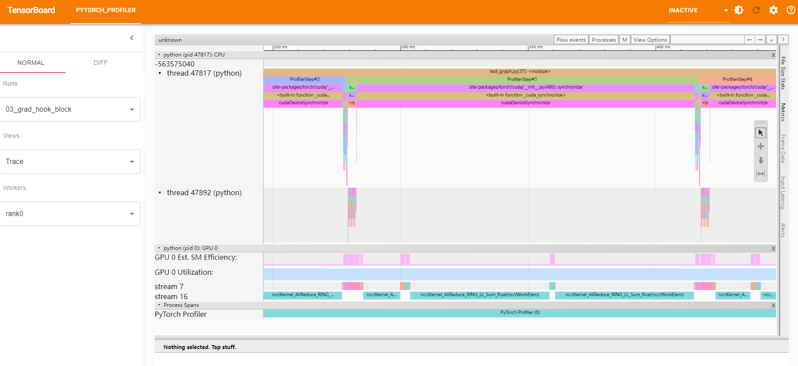
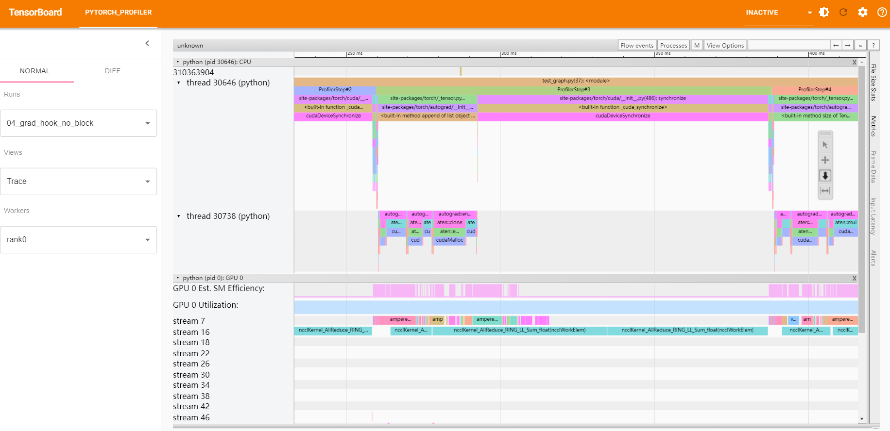
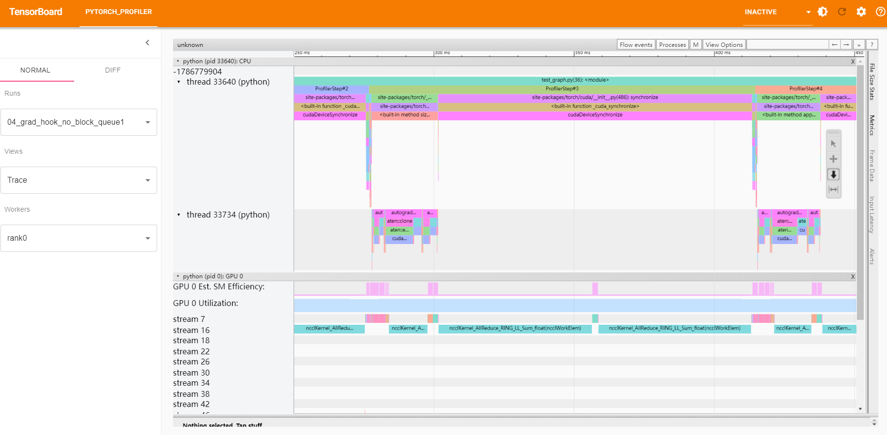

# CUDA Stream & Event

## 学习

1. [CUDA的kernel并行](https://blog.csdn.net/feng__shuai/article/details/122441011)

    CUDA 的 Sream 和 硬件工作队列

2. [CUDA流：利用并行执行提高性能](https://blog.csdn.net/Algabeno/article/details/129152135)

    CUDA流API的使用

3. [动手学深度学习12.2. 异步计算](https://zh.d2l.ai/chapter_computational-performance/async-computation.html)

    pytorch中的kernel是异步的，不会等待执行完才继续后面kernel的启动

4. [详解Pytorch里的pin_memory 和 non_blocking](https://cloud.tencent.com/developer/article/2000487)

    在CUDA里， "Stream"是指一系列的操作，这些操作按照主机代码发出的顺序在设备上执行。同一个Stream里的操作是按顺序执行的，而不同Stream里的操作可以交错执行，并且在可能的情况下，它们甚至可以并发执行。

    stream有很多种，无特殊指定的话使用的就是默认stream（default stream，也称作 null stream）。它和其他stream的却比就在于：1）如果其他stream上的操作没结束，null stream就不会开始； 2）在device上的其他stream要开始之前，null stream必须先完成。所以说null stream是设备相关操作的同步流（synchronizing stream）。

5. [How to Overlap Data Transfers in CUDA C/C++](https://developer.nvidia.com/blog/how-overlap-data-transfers-cuda-cc/)

    有一个例子间接说明了`os.environ["CUDA_DEVICE_MAX_CONNECTIONS"] = "1"`的影响，即计算kernel会延迟通信kernel执行

6. [GPU Pro Tip: CUDA 7 Streams Simplify Concurrency](https://developer.nvidia.com/blog/gpu-pro-tip-cuda-7-streams-simplify-concurrency/)

    cuda7的新特性，可选设置，每个host线程创建自己的默认流，并且默认流不会阻塞其他流

7. [使用 NVIDIA CUDA 流顺序内存分配器，第 1 部分](https://developer.nvidia.com/zh-cn/blog/using-cuda-stream-ordered-memory-allocator-part-1/)

    CUDA 的 Stream 和 Event，详细的例子

8. [CUDA ---- Stream and Event](https://www.cnblogs.com/1024incn/p/5891051.html)

    相关的CUDA的API

## 测试

使用torch的register_comm_hook()来测试计算和通信的同步情况

梯度的同步中加了一个kernel的执行，需要等待通信.wait()

### 03_test_graph_block
不设置stream，hook会阻塞backward，因为在同一个stream中，导致执行顺序必须一致，但是梯度的同步应该与后续的backward的无关

### 04_test_graph_no_block
设置stream，可以看到hook没有阻塞backward，实现了同步

### 05_test_graph_no_block_queue1
设置stream，但是也设置`os.environ["CUDA_DEVICE_MAX_CONNECTIONS"] = "1"`，会使得可用硬件工作队列为1，导致实际上也只有一个stream，会阻塞backward

